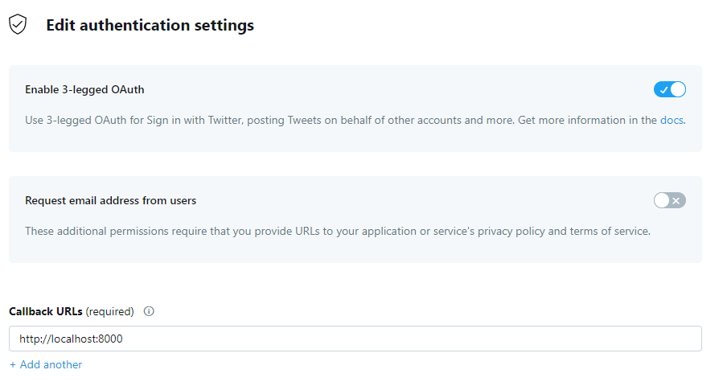

# get_twitter_oauth_key

Twitter APIからOAuth認証を使ってAccessTokenを取得するスクリプトです

Script to get AccessToken from Twitter API using OAuth authentication.

# 使い方
```
git clone https://github.com/nerrog/get_twitter_oauth_key
pip install -r requirements.txt
python3 main.py [ConsumerKey] [ConsumerSecret] [OAuth_callback]
```

# Twitter Developer Portalの操作
アプリの`Authentication settings`を編集します。

`Enable 3-legged OAuth`を`ON`にします

`Callback URLs`に`http://localhost:8000`と入力して保存します。

